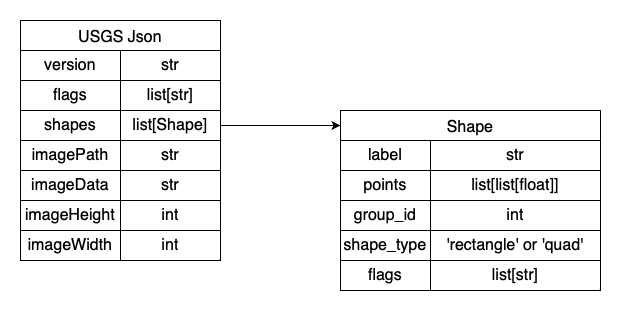
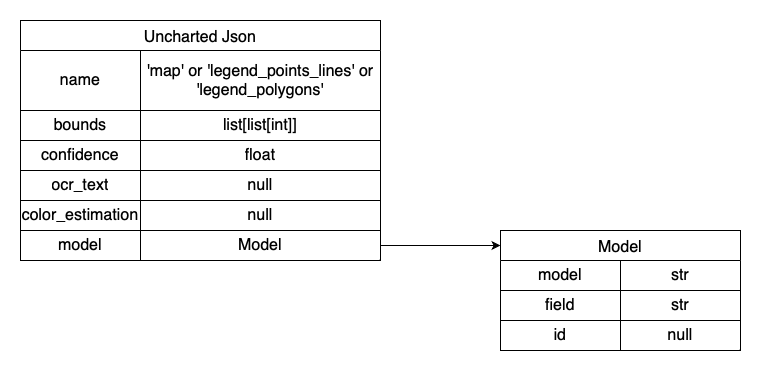

# TA1 Legend Extraction

## Description
This is the internal UIUC repo for the Legend Extraction portion of DARPA CMASS project. 

## My TODO list
* Finish ReadME
  * Add Description of all the plots
* Put comments in notebooks so they are useful as learning tools

## Requirements
This repo requires the following packages:
* opencv
* matplotlib
* pandas
* tqdm
* easyocr

## Example Script
legendExtractor.py is the example script for showing how to use the legend extraction code. 


```
# Example Usage
python LegendExtractor.py training/images -o train_legend_results -m training/uncharted_masks -t training/usgs_legends
```

| Argument        | Default        | Description       |
| :-------------- | :------------: | :---------------- |
| data            | N/A            | Path to the directory containing the images to perform legend extraction on. |
| -o, --outputDir | legend_results | Path to the directory that the resulting json will be written to. If automatic scoring or debugging is enabled there respective outputs will be written here as well. |
| -m, --maskDir   | None           | Path to a directory containing json files to be used for masking out the legend area. json should be in [uncharted format](#uncharted-json-format) and json file should have same name as its corrasponding image file. |
| -t, --truthDir  | None           | Path to a directory containing json files to be used as truth values in automatic scoring. json should be in [usgs format](#usgs-json-format) and json file should have same name as its corrasponding image file. |
| --debug         | False          | Flag to set enable debug statements in the log. |


## Key Functions

### extraction.extractLegends(image, legendcontour=None)

extractLegends is the main function for generating predicted legends. It takes the map image and returns a json of the predictions in the USGS style. filename is an optional argument to add the img_filename that it was generated on which is consistent with USGS given jsons.

### IO.generateJsonData(features, filename='', force_rectangle=False, img_dims=False)

This function converts the output of extractLegends to the json format that follows the usgs format from the compition 

### scoreLegendExtraction(image, truth_json, predict_json, outputDir=None)

scoreLegendExtraction is the main function for scoring and takes the map image the json of the truth legends and the json of predicted legends. It then scores these based on the label and intersection of the contours.

outputDir is an optional argument that controls weather the debugging plots are generated.
When the outputDir argument is set scoreLegendExtraction will save the scores of each map as well as an annotated version of the map with some helpful plots and cutouts of all of the missed and ocr failed polygon labels. The legendExtractionDemo adds on this by producing a full dataset score and overview files as well. The structure of this output is as shown below.

```bash
outputDir
├── #[sourceDir]_Overview.png
├── #[sourceDir]_Scores.csv
├── Map1
│   ├── #Map1_Overview.png
│   ├── #Map1_Scores.png
│   ├── Poly1.tif
│   ├── Poly2.tif...
│   └── PolyX.tif
├── Map2...
└── MapX
```

## USGS Json format 
The USGS json format is mostly the same format as the one used for the CMA competition, but now the shape_type field indicates whether there are 2 points (rectangle) or 4 points (quad) to describe the bounding box.



Current as of Dec 2023

## Uncharted Json format
The Uncharted Json is based on the TA1 schema (i.e., list of PageExtraction schema objects) and has three segmentation classes:
  * map -- the main map region
  * legend_polygons -- legend region for polygon features
  * legend_points_lines -- legend region for point and/or line features



Current as of Dec 2023

## Authors and acknowledgment
This repo was created by and currently maintained by Albert Bode.